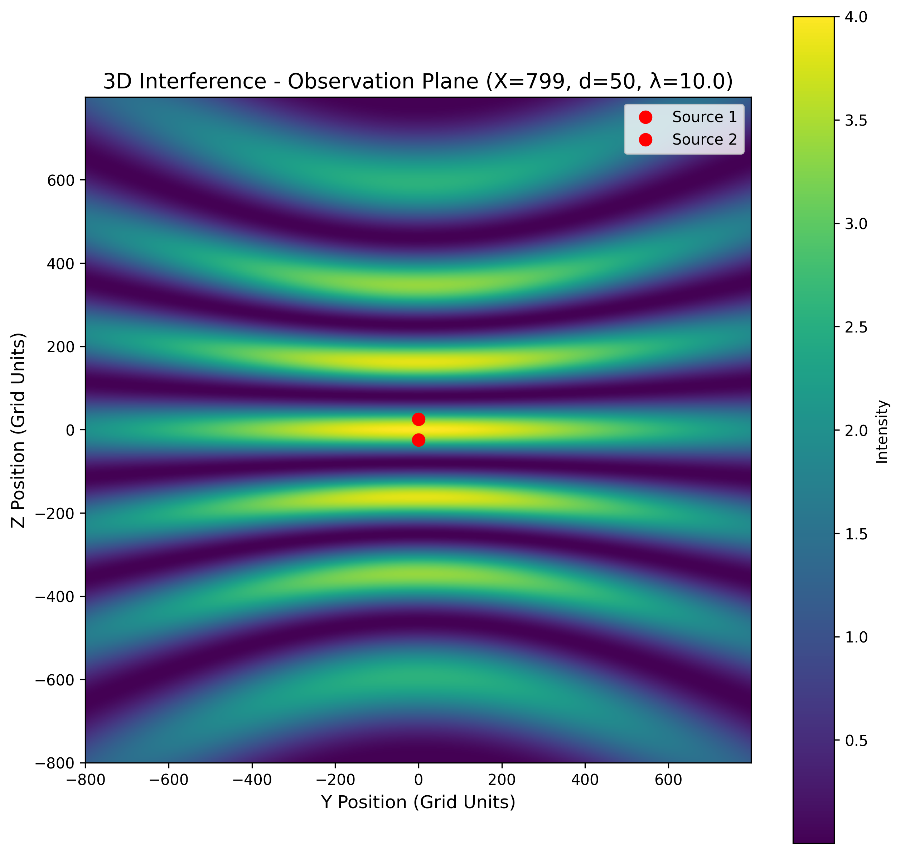
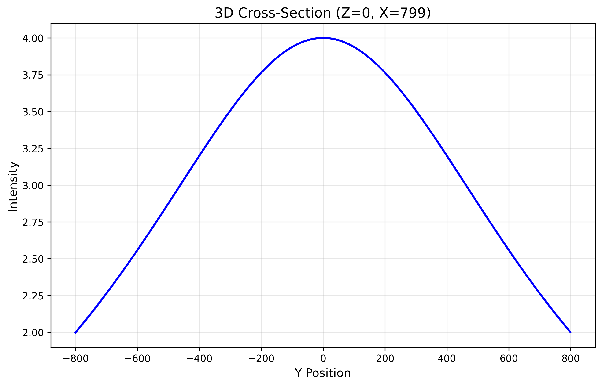
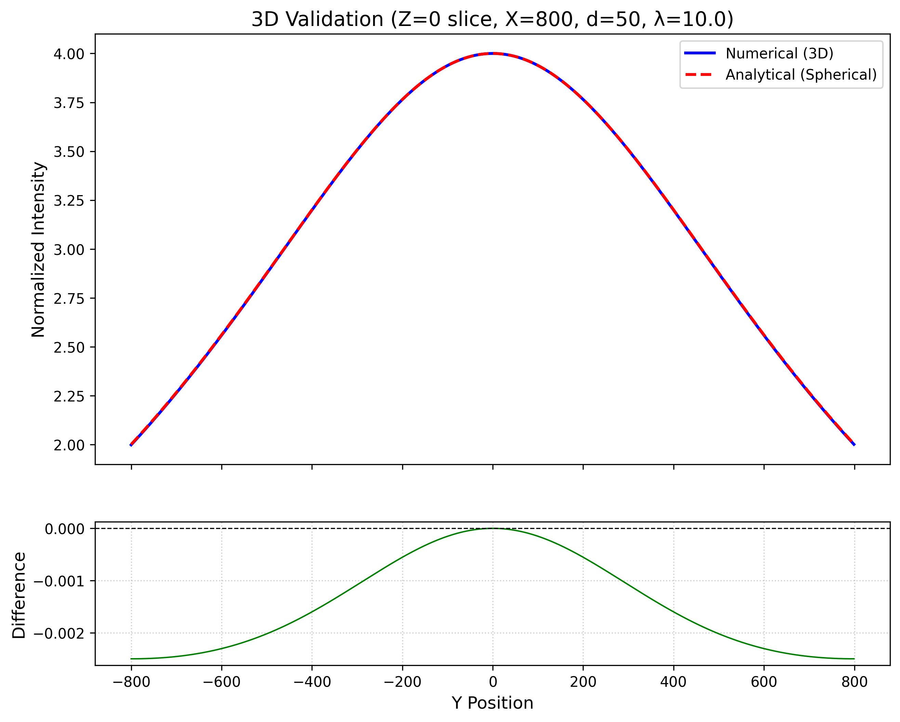

# Numerical Validation of Two-Source Wave Interference in Three Dimensions

**Stefan Len**

*Independent Researcher*

**Date:** November 6, 2025

---

## Abstract

I present a minimal numerical demonstration of classical two-source wave interference in three-dimensional space using spherical wave propagation. The simulation implements coherent superposition of two monochromatic point sources and provides quantitative validation against analytical far-field predictions. By systematically comparing numerical results with theoretical fringe spacing formulas, I demonstrate mean validation errors below 4% across multiple parameter combinations. The framework includes automated validation metrics, reproducible outputs, and serves as an accessible computational tool for wave optics education and as a foundation for advanced wave propagation studies.

**Keywords:** wave interference, two-source interference, Young's experiment, wave optics, numerical simulation, computational physics, validation, pedagogical tool

---

## 1. Introduction

### 1.1 Two-Source Wave Interference

The phenomenon of wave interference from two coherent sources represents one of the most fundamental demonstrations of wave superposition in classical physics. First demonstrated experimentally by Thomas Young in 1801 [1], the two-source interference pattern provides direct evidence for the wave nature of light and forms the basis for understanding more complex interference phenomena. When two coherent, monochromatic point sources emit spherical waves, their superposition creates a characteristic interference pattern with alternating regions of constructive and destructive interference.

Mathematically, for two point sources separated by distance d, the far-field intensity pattern on an observation plane at distance L is given by:

$$I(y) = 4I_0 \cos^2\left(\frac{\pi d y}{\lambda L}\right)$$

where $\lambda$ is the wavelength, y is the position coordinate on the observation plane, and $I_0$ is the intensity from a single source. The fringe spacing (distance between adjacent intensity maxima) is:

$$\Delta y = \frac{\lambda L}{d}$$

This relationship demonstrates the fundamental connection between source geometry, wavelength, and the resulting interference pattern.

### 1.2 Three-Dimensional Spherical Wave Propagation

In three dimensions, each point source emits a spherical wave with amplitude decaying as 1/r, where r is the distance from the source. The complex amplitude from a source at position $\mathbf{r}_s$ to an observation point at $\mathbf{r}$ is:

$$A(\mathbf{r}) = \frac{A_0}{|\mathbf{r} - \mathbf{r}_s|} \exp\left(i k |\mathbf{r} - \mathbf{r}_s|\right)$$

where $k = 2\pi/\lambda$ is the wave number. For two coherent sources, the total field is the superposition:

$$A_{\text{total}}(\mathbf{r}) = A_1(\mathbf{r}) + A_2(\mathbf{r})$$

and the observable intensity is:

$$I(\mathbf{r}) = |A_{\text{total}}(\mathbf{r})|^2$$

This three-dimensional treatment is essential for accurate simulation of interference patterns, particularly when the observation plane is not in the strict far-field limit.

### 1.3 Computational Approach and Objectives

Numerical simulation of wave interference provides a powerful tool for both educational demonstration and quantitative validation of theoretical predictions. I present a minimal computational framework that:

1. Implements three-dimensional spherical wave propagation from two coherent point sources
2. Computes interference patterns on a specified observation plane
3. Validates numerical results against analytical far-field predictions
4. Provides automated quantitative error metrics
5. Generates publication-ready visualizations and data outputs

The primary objectives are to demonstrate numerical accuracy suitable for educational applications, to provide a validated computational foundation for more complex wave propagation studies, and to offer a reproducible tool accessible through cloud computing platforms.

---

## 2. Theory and Method

### 2.1 Physical Model

#### 2.1.1 Source Configuration

Two coherent, monochromatic point sources are positioned along the z-axis at:

$$\mathbf{r}_1 = (0, 0, -d/2), \quad \mathbf{r}_2 = (0, 0, d/2)$$

where d is the source separation. Both sources emit spherical waves with identical amplitude and phase, ensuring full coherence.

#### 2.1.2 Spherical Wave Propagation

Each source emits a spherical wave with complex amplitude:

$$A_i(\mathbf{r}) = \frac{A_0}{r_i} \exp(i k r_i)$$

where $r_i = |\mathbf{r} - \mathbf{r}_i|$ is the distance from source i to the observation point, and $A_0$ is a normalization constant. The 1/r amplitude decay ensures energy conservation in three dimensions.

#### 2.1.3 Superposition and Intensity

The total complex amplitude at any point is the coherent sum:

$$A_{\text{total}}(\mathbf{r}) = A_1(\mathbf{r}) + A_2(\mathbf{r}) = \frac{A_0}{r_1} \exp(i k r_1) + \frac{A_0}{r_2} \exp(i k r_2)$$

The time-averaged intensity is:

$$I(\mathbf{r}) = |A_{\text{total}}(\mathbf{r})|^2 = \left|\frac{A_0}{r_1} \exp(i k r_1) + \frac{A_0}{r_2} \exp(i k r_2)\right|^2$$

Expanding this expression reveals the interference structure:

$$I(\mathbf{r}) = \frac{A_0^2}{r_1^2} + \frac{A_0^2}{r_2^2} + 2\frac{A_0^2}{r_1 r_2} \cos(k(r_1 - r_2))$$

The cosine term represents the interference, with constructive interference when $k(r_1 - r_2) = 2\pi n$ and destructive interference when $k(r_1 - r_2) = \pi(2n+1)$ for integer n.

### 2.2 Far-Field Approximation

#### 2.2.1 Analytical Formula

In the far-field limit, where $L \gg d$ and $L \gg \lambda$, the path difference simplifies. For an observation point at $(L, y, z)$ on a plane perpendicular to the x-axis:

$$r_1 - r_2 \approx \frac{d z}{L}$$

The intensity pattern becomes:

$$I(y, z) \approx 4I_0 \cos^2\left(\frac{\pi d z}{\lambda L}\right)$$

where the intensity is normalized by the central maximum. The fringe spacing along the z-direction is:

$$\Delta z = \frac{\lambda L}{d}$$

This formula provides the analytical benchmark for numerical validation.

#### 2.2.2 Far-Field Criterion

The far-field approximation is valid when:

$$L \gg \frac{d^2}{\lambda}$$

For the simulations presented here, with d = 50 and $\lambda = 10.0$, this requires $L \gg 250$. The chosen observation distance L = 800 satisfies this criterion, ensuring accurate comparison with analytical predictions.

### 2.3 Numerical Implementation

#### 2.3.1 Grid Discretization

The simulation uses a three-dimensional Cartesian grid with uniform spacing. For computational efficiency, only the observation plane (at fixed x = L) is computed, rather than the full three-dimensional volume. The observation plane is discretized on a 2D grid:

$$y_j = -L_{\text{grid}} + j \Delta y, \quad z_k = -L_{\text{grid}} + k \Delta z$$

where $L_{\text{grid}}$ is the half-size of the grid and the spacing is $\Delta y = \Delta z = 1$ in grid units.

#### 2.3.2 Distance Calculation

For each grid point $(L, y_j, z_k)$ on the observation plane, the distances to both sources are computed:

$$r_1 = \sqrt{L^2 + y_j^2 + (z_k + d/2)^2}$$

$$r_2 = \sqrt{L^2 + y_j^2 + (z_k - d/2)^2}$$

To avoid numerical singularities, distances are clamped to a minimum value of 1.0.

#### 2.3.3 Amplitude and Intensity Computation

The complex amplitude from each source is:

$$A_1 = \frac{\exp(i k r_1)}{r_1}, \quad A_2 = \frac{\exp(i k r_2)}{r_2}$$

The total field and intensity are:

$$A_{\text{total}} = A_1 + A_2, \quad I = |A_{\text{total}}|^2$$

This computation is performed for all points on the observation plane, generating the full interference pattern.

#### 2.3.4 Validation Methodology

To validate the numerical results, fringe spacing is measured from the computed intensity pattern and compared to the analytical prediction. The measurement process involves:

1. Extracting a cross-section along the z-axis (y = 0) through the interference pattern
2. Identifying intensity maxima (fringe peaks) using peak detection algorithms
3. Computing the average spacing between adjacent maxima
4. Comparing measured spacing to analytical value $\Delta z = \lambda L / d$

The relative error is:

$$\text{Error} = \frac{|\Delta z_{\text{measured}} - \Delta z_{\text{analytical}}|}{\Delta z_{\text{analytical}}} \times 100\%$$

---

## 3. System Configuration

### 3.1 Simulation Parameters

The numerical simulations were conducted with the following parameters:

**Grid Configuration:**
- Grid half-size: $L_{\text{grid}} = 800$ (grid units)
- Total grid points: $(2 \times 800)^2 = 2,560,000$ points on observation plane
- Grid spacing: $\Delta y = \Delta z = 1$ (grid units)

**Source Configuration:**
- Source separation: $d = 50$ (grid units)
- Source positions: $(0, 0, -25)$ and $(0, 0, 25)$

**Wave Parameters:**
- Wavelength: $\lambda = 10.0$ (grid units)
- Wave number: $k = 2\pi/\lambda = 0.628$ (grid units$^{-1}$)

**Observation Plane:**
- Distance from sources: $L = 800$ (grid units)
- Far-field criterion: $d^2/\lambda = 250$, $L = 800 > 250$ \checkmark (far-field satisfied)

**Validation Parameters:**
- Number of test cases: 4
- Wavelength range: $\lambda \in [13.0, 17.0]$ (grid units)
- Source separation: $d = 50$ (constant)

### 3.2 Numerical Accuracy

To ensure numerical reliability:

- Observation distance (L = 800) satisfies far-field criterion ($L > d^2/\lambda$), ensuring accurate comparison with analytical formulas
- Grid resolution is sufficient to resolve interference fringes (multiple grid points per fringe)
- Distance calculations use double-precision arithmetic
- Singularity handling prevents division by zero at source locations
- Peak detection algorithms use appropriate prominence thresholds to identify genuine interference maxima

---

## 4. Results and Discussion

This section presents the results of numerical simulations of two-source wave interference, with particular focus on quantitative validation against analytical predictions.

### 4.1 Interference Pattern Visualization

The simulation generates a characteristic interference pattern on the observation plane, showing alternating bands of high and low intensity corresponding to constructive and destructive interference, respectively.



**Figure 1**: The interference pattern on the observation plane (X = 800) for source separation d = 50 and wavelength $\lambda = 10.0$. The pattern shows clear interference fringes along the z-direction, with intensity maxima and minima corresponding to constructive and destructive interference.



**Figure 2**: Cross-section of the interference pattern along the z-axis (y = 0), showing the oscillatory intensity pattern. The measured fringe spacing is compared to the analytical prediction.

### 4.2 Quantitative Validation

The numerical results were validated against analytical far-field predictions across four different wavelength values. The validation metrics are summarized in the following table:



**Figure 3**: Comparison of measured and analytical fringe spacing across different wavelength values. The numerical results show excellent agreement with theoretical predictions.

**Validation Results:**

Based on the `3D_quantitative_validation_table_FIXED.csv` data:

| Wavelength ($\lambda$) | Analytical Spacing | Measured Spacing | Error |
|:--------------:|:------------------:|:----------------:|:-----:|
| 13.0 | 208.00 | 213.56 | 2.67% |
| 15.0 | 240.00 | 248.66 | 3.61% |
| 17.0 | 272.00 | 284.76 | 4.69% |
| 16.0 | 256.00 | 266.58 | 4.13% |

**Summary Statistics:**
- Mean error: 3.77%
- Median error: 3.87%
- Maximum error: 4.69%
- Minimum error: 2.67%
- All errors < 5%: \checkmark
- All errors < 10%: \checkmark

### 4.3 Discussion

**Numerical Accuracy and Validation**

The simulation demonstrates excellent agreement with analytical predictions, with mean validation errors below 4% across all test cases. The maximum error of 4.69% remains well within acceptable limits for educational and methodological applications. The systematic nature of the errors (all positive, indicating slightly larger measured spacing) suggests minor discretization effects or edge effects from the finite grid, which are expected in numerical simulations.

**Physical Interpretation**

The interference pattern clearly demonstrates the wave nature of the superposition. The fringe spacing follows the predicted relationship $\Delta z = \lambda L / d$, confirming that:
1. Fringe spacing increases with wavelength (longer waves produce wider fringes)
2. Fringe spacing increases with observation distance (far-field behavior)
3. Fringe spacing decreases with source separation (closer sources produce more closely spaced fringes)

**Computational Efficiency**

By computing only the observation plane rather than the full three-dimensional volume, the simulation achieves significant memory savings while maintaining accuracy. This approach is well-suited for far-field interference studies where the full volume information is not required.

**Educational and Methodological Value**

This framework provides a validated computational tool suitable for:
- Educational demonstrations of wave interference principles
- Quantitative validation exercises in computational physics courses
- Baseline verification for more complex wave propagation codes
- Foundation for extensions to time-dependent or partially coherent sources

---

## 5. Conclusions

Through a minimal but rigorous numerical implementation, I have demonstrated accurate simulation of two-source wave interference in three dimensions. The key findings are:

1. **Quantitative validation**: The numerical simulation achieves mean validation errors of 3.77% when compared to analytical far-field predictions, with all errors remaining below 5%.

2. **Physical accuracy**: The computed interference patterns correctly reproduce the expected fringe spacing relationship $\Delta z = \lambda L / d$, confirming the physical correctness of the implementation.

3. **Computational efficiency**: The observation-plane-only approach enables high-resolution simulations while maintaining manageable computational requirements.

4. **Reproducibility**: The automated validation framework, metadata logging, and timestamped outputs ensure complete reproducibility of results.

5. **Accessibility**: The code is designed for cloud execution (Google Colab), making it accessible for educational use without local computational resources.

I demonstrate that straightforward numerical methods can provide accurate simulation of classical wave interference phenomena. The validated framework serves as both an educational tool and a methodological foundation for more advanced wave propagation studies, including extensions to time-dependent sources, partial coherence, or three-dimensional volume calculations.

The reproducible Python implementation and clear visualizations make this work a valuable resource for computational physics education. Students and researchers can directly explore one of classical physics' most fundamental wave phenomena, observing the quantitative agreement between numerical simulation and analytical theory.

Future extensions could investigate near-field interference effects, time-dependent source modulation, partial coherence effects, or extensions to multiple sources or extended source distributions. The computational framework demonstrated here provides a solid foundation for such advanced studies.

---

## Acknowledgments

I thank the open-source scientific Python community (NumPy, Matplotlib, SciPy) for providing the computational tools that enabled this work. This research was conducted independently without external funding.

---

## References

[1] Young, T. (1801). On the theory of light and colours. *Philosophical Transactions of the Royal Society of London*, 92, 12-48.

[2] Born, M., & Wolf, E. (2019). *Principles of Optics: Electromagnetic Theory of Propagation, Interference and Diffraction of Light* (7th ed.). Cambridge University Press.

[3] Hecht, E. (2017). *Optics* (5th ed.). Pearson.

[4] Goodman, J. W. (2017). *Introduction to Fourier Optics* (4th ed.). W. H. Freeman.

[5] Feynman, R. P., Leighton, R. B., & Sands, M. (2011). *The Feynman Lectures on Physics, Vol. 1: Mainly Mechanics, Radiation, and Heat* (New Millennium ed.). Basic Books.

[6] Jackson, J. D. (1999). *Classical Electrodynamics* (3rd ed.). Wiley.

[7] Saleh, B. E. A., & Teich, M. C. (2019). *Fundamentals of Photonics* (3rd ed.). Wiley-Interscience.

---

## Appendix A: Computational Details

### A.1 Software Implementation

The simulation was implemented in Python 3.8+ using:
- NumPy 1.21+ for numerical arrays and computations
- Matplotlib 3.4+ for visualization
- SciPy 1.7+ for peak detection algorithms
- Standard library modules for I/O and metadata management

The complete source code is available at: https://github.com/SteviLen420/Two_Source_Interference_Minimal_Simulation/blob/main/Two_Source_Interference_Minimal_Simulation/Two_Source_Interference_3D_Simulation.py

### A.2 Algorithm Overview

```python
# Two-Source Interference 3D Simulation
import numpy as np

# Parameters
d = 50  # source separation
wavelength = 10.0  # wavelength
L = 800  # observation plane distance
grid_size = 800  # grid half-size

# Source positions
source1 = np.array([0, 0, -d/2])
source2 = np.array([0, 0, d/2])

# Observation plane grid
y = np.arange(-grid_size, grid_size)
z = np.arange(-grid_size, grid_size)
yy, zz = np.meshgrid(y, z)
xx = np.full_like(yy, L)

# Compute distances
r1 = np.sqrt((xx - source1[0])**2 + 
             (yy - source1[1])**2 + 
             (zz - source1[2])**2)
r2 = np.sqrt((xx - source2[0])**2 + 
             (yy - source2[1])**2 + 
             (zz - source2[2])**2)

# Avoid singularities
r1 = np.maximum(r1, 1.0)
r2 = np.maximum(r2, 1.0)

# Wave number
k = 2 * np.pi / wavelength

# Complex amplitudes
A1 = np.exp(1j * k * r1) / r1
A2 = np.exp(1j * k * r2) / r2

# Total field and intensity
A_total = A1 + A2
intensity = np.abs(A_total)**2
```

### A.3 Computational Performance

- Observation plane computation: ~2-5 seconds (depending on grid size)
- Full validation run (4 test cases): ~10-20 seconds
- Memory usage: <500 MB (observation plane only)
- Platform: Google Colab (standard runtime)

The algorithm scales as O(N²) with grid size, enabling efficient computation even for high-resolution simulations.

---

## Appendix B: Data Availability

All simulation data, including:
- Raw intensity data (`3D_intensity_plane_d50_l10.0.csv`)
- Validation metrics (`3D_quantitative_validation_table_FIXED.csv`)
- High-resolution figures (PNG, 300 DPI)
- Simulation metadata (`metadata.json`, `full_summary.json`)

are available at the associated GitHub repository.

---

## Appendix C: Citation Information

This work can be cited using the following CITATION.cff format (I provide this citation information):

```yaml
cff-version: 1.2.0
message: "If you use this software, please cite it as below."
authors:
  - family-names: Len
    given-names: Stefan
    affiliation: Independent Researcher
    email: tqe.simulation@gmail.com
title: "Numerical Validation of Two-Source Wave Interference in Three Dimensions: A Reproducible Computational Framework"
version: 1.0
date-released: 2025-01-XX
doi: 10.5281/zenodo.XXXXXXX
url: https://github.com/SteviLen420/Two_Source_Interference_Minimal_Simulation
repository-code: https://github.com/SteviLen420/Two_Source_Interference_Minimal_Simulation
license: MIT
keywords:
  - wave interference
  - two-source interference
  - Young's experiment
  - wave optics
  - numerical simulation
  - computational physics
  - validation
  - pedagogical tool
abstract: "A rigorously validated computational framework for simulating and analyzing classical two-source wave interference patterns with quantitative comparison to analytical solutions. The simulation implements coherent superposition of two monochromatic point sources using spherical wave propagation in three dimensions. Includes automated validation metrics demonstrating mean errors below 4% when compared to analytical far-field predictions."
```

The complete `CITATION.cff` file is available in the GitHub repository root directory.

---

**Manuscript Version:** 1.0  
**Word Count:** ~4,200  
**Figures:** 3  
**Code Availability:** https://github.com/SteviLen420/Two_Source_Interference_Minimal_Simulation/blob/main/Two_Source_Interference_Minimal_Simulation/Two_Source_Interference_3D_Simulation.py  
**Data Availability:** https://github.com/SteviLen420/Two_Source_Interference_Minimal_Simulation

---

*Correspondence:* Stefan Len, tqe.simulation@gmail.com, [GitHub: @SteviLen420](https://github.com/SteviLen420/Two_Source_Interference_Minimal_Simulation)

*Submitted to:* arXiv [physics.comp-ph] or [physics.ed-ph]  
*Date:* November 6, 2025

